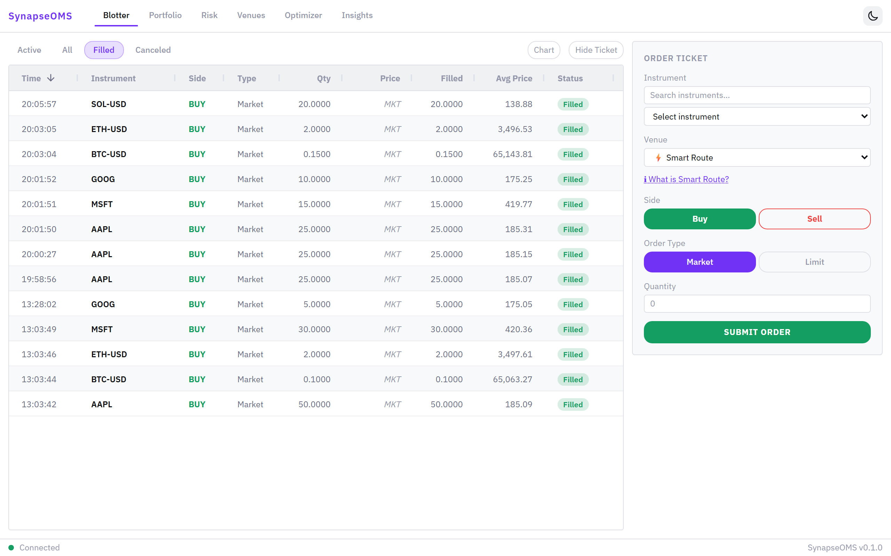
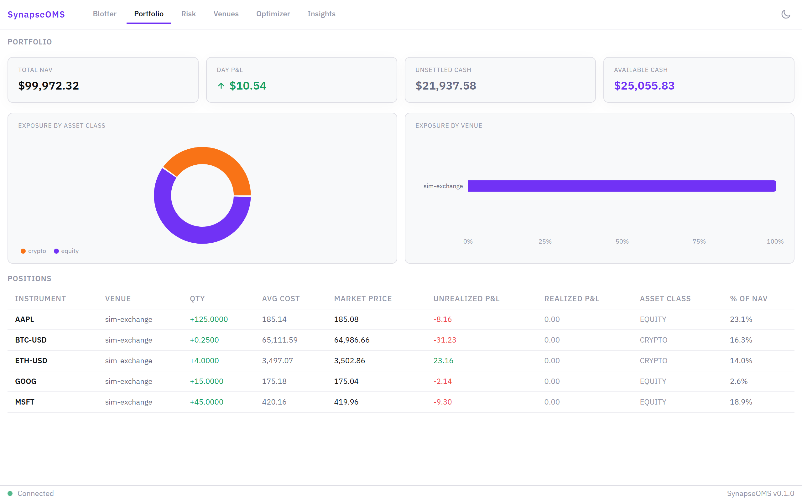
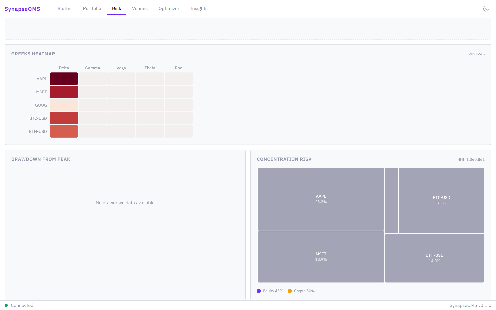
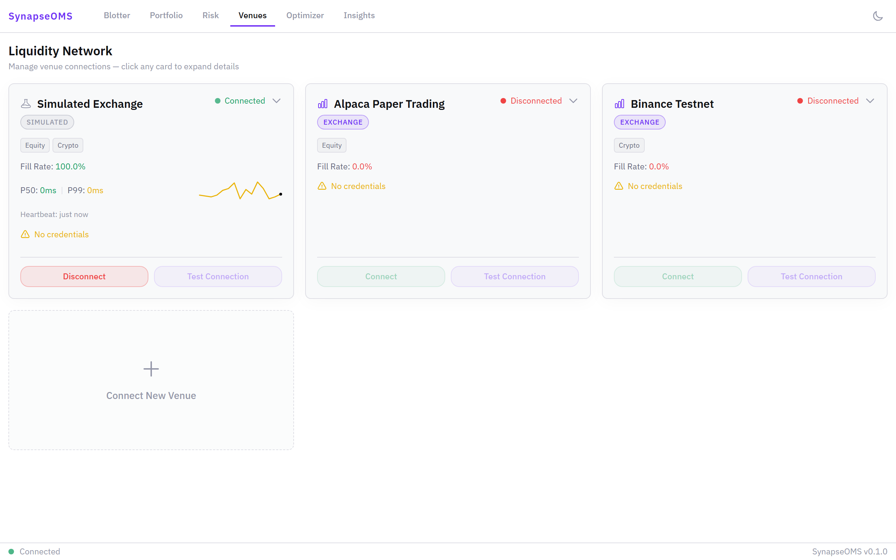
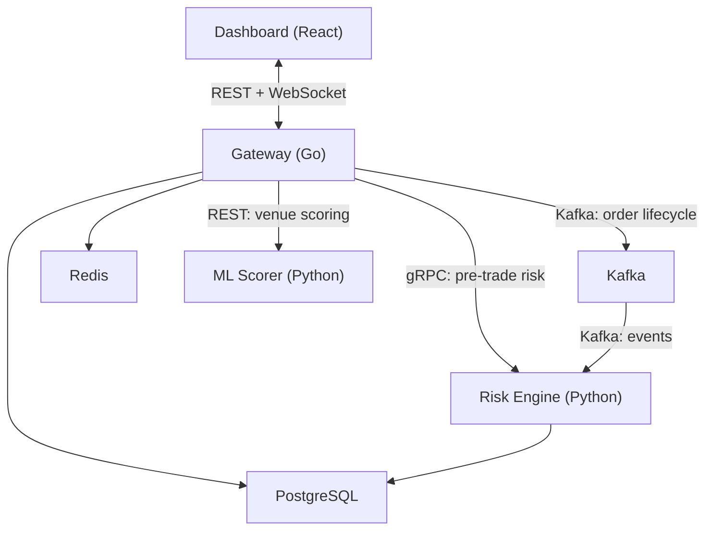

# SynapseOMS

**The open-source trading terminal for traders who work across equities and crypto.**


There's no affordable tool that lets you see unified risk, execute across both traditional and crypto markets, and get AI-driven analysis from a single interface. Bloomberg costs $24k/year. Retail tools ignore half your portfolio. SynapseOMS fills the gap — and your keys, data, and strategies never leave your machine.

## Who is this for?

- Algorithmic traders running strategies across equities + crypto
- Small crypto-native funds (1-5 people) that also hold traditional positions
- RIAs managing clients with both asset classes
- Quant researchers going from backtest to live

## Quickstart (3 minutes)

```bash
git clone https://github.com/essandhu/SynapseOMS.git
cd SynapseOMS
cp deploy/.env.example deploy/.env
# Edit deploy/.env — set SYNAPSE_MASTER_PASSPHRASE to a strong passphrase
docker compose -f deploy/docker-compose.yml up
```

Open [http://localhost:3000](http://localhost:3000). The onboarding flow will guide you through connecting the built-in simulated exchange — no external API keys needed.

<picture>
  <source media="(prefers-color-scheme: dark)" srcset="docs/media/blotter-dark.png">
  
</picture>

For the full step-by-step guide, see [docs/quickstart.md](docs/quickstart.md).

## Features

- **Unified order management** across Alpaca (equities) and Binance (crypto)
- **Cross-asset risk analytics**: VaR, Greeks, concentration, drawdown
- **AI-powered execution analysis** and portfolio rebalancing
- **Smart order routing** with ML venue scoring
- **Self-hosted**: your keys never leave your machine
- **Extensible**: add new exchanges by implementing one interface

<table>
  <tr>
    <td width="50%">
      
      <p align="center"><em>Unified portfolio across equities and crypto</em></p>
    </td>
    <td width="50%">
      
      <p align="center"><em>Greeks and concentration risk from live positions</em></p>
    </td>
  </tr>
  <tr>
    <td colspan="2">
      
      <p align="center"><em>Venue connections with fill rate and latency at a glance</em></p>
    </td>
  </tr>
</table>

## Architecture

SynapseOMS is three services — a Go gateway, a Python risk engine, and a React dashboard — connected by Kafka and backed by PostgreSQL.



For the full architecture, see [docs/architecture-overview.md](docs/architecture-overview.md).

## Documentation

| Guide | Description |
|-------|-------------|
| [Quickstart](docs/quickstart.md) | From `git clone` to trading in 3 minutes |
| [Connect Your First Exchange](docs/connect-venue.md) | Set up Alpaca paper trading or Binance testnet |
| [Write a Venue Adapter](docs/write-adapter.md) | Add support for a new exchange |
| [Architecture Overview](docs/architecture-overview.md) | How the system works |

## Contributing

The primary contribution path is **venue adapters** — adding support for new exchanges. See [docs/write-adapter.md](docs/write-adapter.md) to get started, or read [CONTRIBUTING.md](CONTRIBUTING.md) for the full guide.

## License

[AGPLv3](LICENSE) — free to use, modify, and self-host. If you offer SynapseOMS as a hosted service, you must open-source your modifications.
