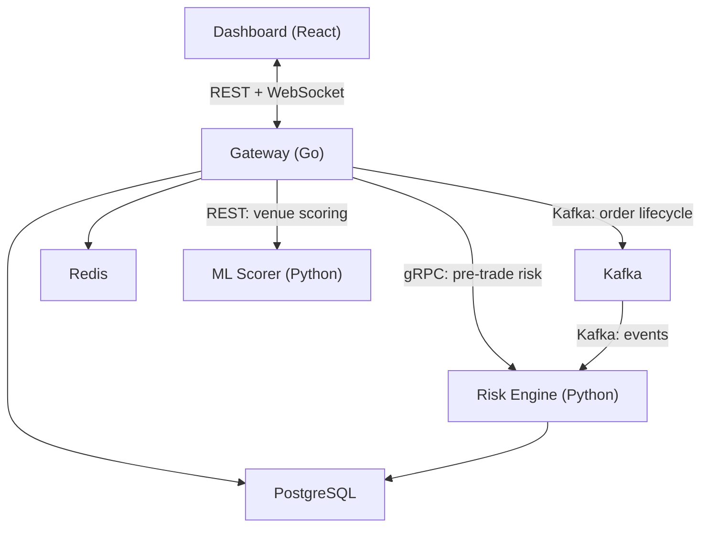

# Architecture Overview

SynapseOMS is a self-hosted order management system for traders who work across equities and crypto. It consists of three services connected by Kafka and backed by PostgreSQL and Redis.

## Service Topology



## Services

### Gateway (Go) — Port 8080

The central service. Handles order intake, routing, venue communication, and real-time streaming.

- **REST API**: Order submission, position queries, venue management, credential storage
- **WebSocket**: Real-time streams for orders, positions, market data, venue status, anomaly alerts
- **Order Pipeline**: Intake -> risk check -> route -> venue dispatch -> fill collection -> notification
- **Adapter System**: Pluggable venue adapters (Alpaca, Binance, Simulated, Tokenized)
- **Smart Router**: ML-scored venue selection, best-price, and preference-based routing

### Risk Engine (Python) — Port 8081 (REST), 50051 (gRPC)

Portfolio analytics, risk management, and AI features.

- **gRPC**: Pre-trade risk checks (< 10ms target) — order size, concentration, cash, VaR impact
- **REST**: VaR computation (historical, parametric, Monte Carlo), portfolio optimization, Greeks, anomaly alerts
- **Kafka Consumer**: Builds portfolio state from order lifecycle events
- **AI Modules**: Execution quality analysis (Anthropic Claude), NL rebalancing, anomaly detection (Isolation Forest)

### Dashboard (React/TypeScript) — Port 3000

Trading terminal UI with real-time data.

- **Order Blotter**: AG Grid with streaming updates (WebSocket subscription at App level), order ticket panel, scrollable with responsive column sizing
- **Portfolio View**: Positions, NAV, exposure breakdown
- **Risk Dashboard**: VaR gauges, Monte Carlo histogram, Greeks heatmap, concentration treemap, drawdown chart
- **Liquidity Network**: Venue status cards, connect/disconnect venues
- **AI Insights**: Execution reports, NL rebalancing chat, anomaly alerts

## Data Flow

### Order Submission

```
User submits order (Dashboard)
    → REST POST /api/v1/orders (Gateway)
    → Order persisted to PostgreSQL (status: New)
    → Pipeline intake channel
    → gRPC pre-trade risk check (Risk Engine) [< 10ms]
    → Smart Router selects venue, updates order with venue ID
    → Order transitioned to Acknowledged (before venue submission)
    → Venue adapter submits to exchange
    → Fill received from exchange (may arrive synchronously)
    → Fill persisted to PostgreSQL
    → Fill published to Kafka (order-lifecycle topic)
    → Risk Engine consumes fill, updates portfolio state
    → WebSocket broadcasts fill + updated position (Gateway → Dashboard)
```

### Venue Connection

```
User enters credentials (Dashboard)
    → REST POST /api/v1/credentials (Gateway)
    → Argon2id key derivation + AES-256-GCM encryption
    → Encrypted credential stored in PostgreSQL
    → Adapter Connect() called with decrypted credentials
    → Venue status event published to Kafka
    → WebSocket broadcasts status update to Dashboard
```

## Technology Stack

| Layer | Technology |
|-------|-----------|
| Gateway | Go 1.25, Chi router, slog, shopspring/decimal |
| Risk Engine | Python 3.12+, FastAPI, NumPy, SciPy, cvxpy, scikit-learn |
| Dashboard | TypeScript, React 19, Vite 6, Zustand 5, AG Grid, Recharts, Tailwind CSS 4 |
| Messaging | Apache Kafka 3.7 (KRaft mode) |
| Database | PostgreSQL 16 |
| Cache | Redis 7 |
| AI | Anthropic Claude API, XGBoost |
| Monitoring | Prometheus, Grafana |
| Containers | Docker Compose, Kubernetes manifests |

## Key Design Decisions

- **Self-hosted**: All data stays on the user's machine. Credentials are encrypted at rest with a user-chosen passphrase.
- **Adapter pattern**: New exchanges are added by implementing one Go interface (14 methods). See [Write a Venue Adapter](write-adapter.md).
- **Fail-open risk**: If the risk engine is unavailable, orders proceed with a warning log rather than blocking all trading.
- **Event sourcing via Kafka**: Order lifecycle events flow through Kafka, enabling the risk engine to maintain an independent portfolio view.
- **Mixed-calendar support**: VaR computation handles the calendar mismatch between equities (business days) and crypto (24/7).

## Contribution Entry Points

| Want to... | Start here |
|------------|-----------|
| Add an exchange | [docs/write-adapter.md](write-adapter.md) |
| Understand the codebase | This document |
| Set up development | [docs/quickstart.md](quickstart.md) |
| Run tests | [CONTRIBUTING.md](../CONTRIBUTING.md) |
